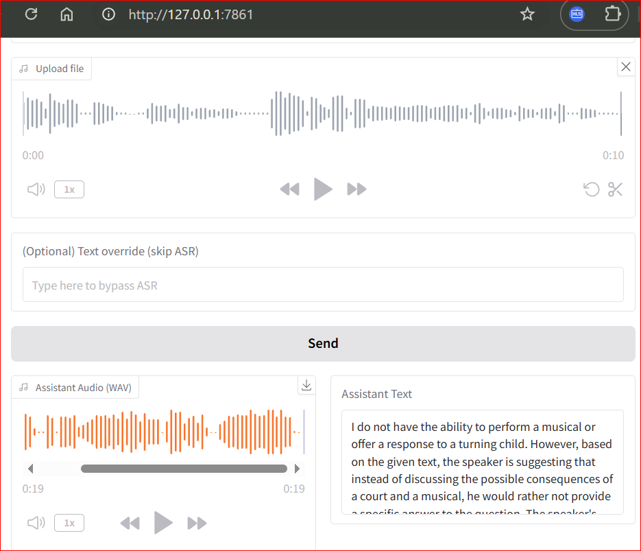
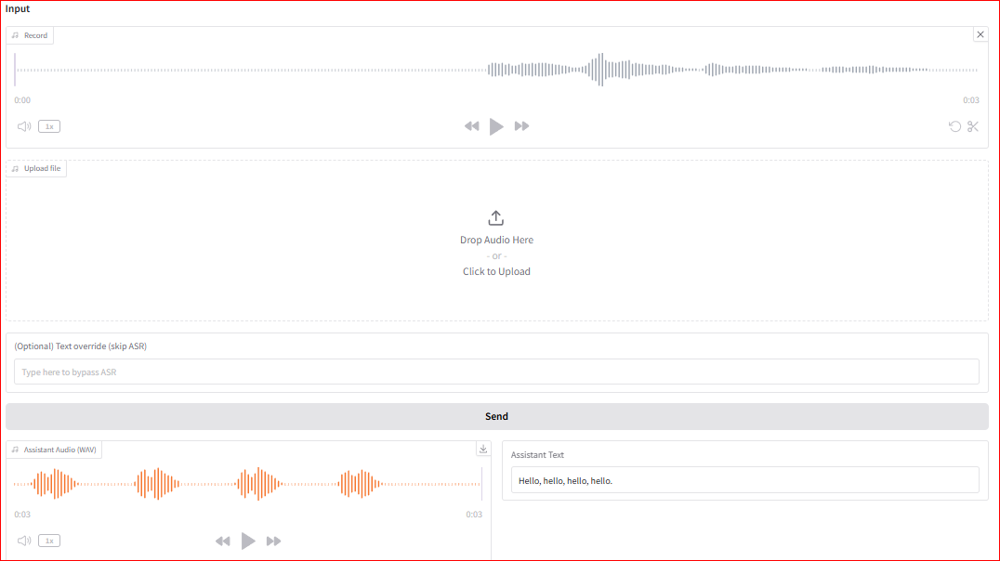

# Homework 3

Name: Andy Fan

# Voice Agent Backend (FastAPI)
# run main_json.py  -- which will display the correct response text in client UI

# Voice Agent Client (Gradio)
# run main.py -- which works with the backend main_json.py

## upload voice file

## record voice from client UI

 